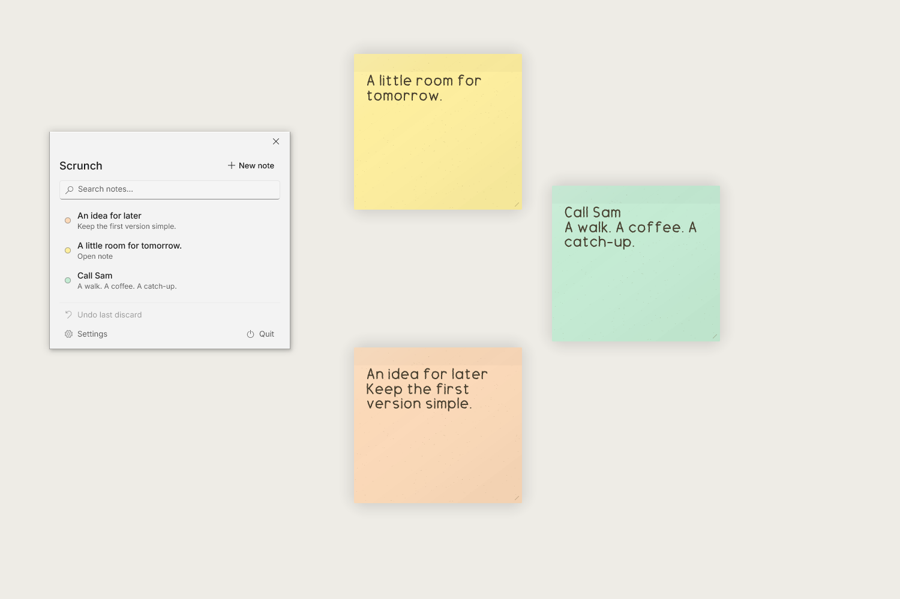

# Scrunch

Tiny native Windows desktop notes with tactile paper and a satisfying crumple.



## What it is

Independent notes that stay where you put them, built with WinUI and native
Windows graphics. Create a note from anywhere, keep Scrunch in the tray, and
scrunch a finished note away. Undo brings it back, including after a restart.
No account, cloud sync, telemetry or analytics service.

## Install

Windows 10 version 1809 or later, x64. Windows 11 is supported by the dependencies;
see the [verification report](docs/RELEASE-VERIFICATION.md) for tested hardware.

Download `Scrunch-0.1.0-Setup.exe` from [Releases](https://github.com/nickzonzh/scrunch/releases).
The installer uses `%LOCALAPPDATA%\Programs\Scrunch`, needs no administrator
rights, and adds Scrunch to the Start Menu. Quit Scrunch before installing an
update. Uninstalling removes the app and its startup entry, while keeping notes.

The ZIP contains the same self-contained application. Extract it completely and
run `Scrunch.exe`. Portable means no installation; notes still use your Windows
profile, and start at sign-in is available only in an installed copy.

The initial binaries are unsigned. Windows may show an unknown-publisher or
SmartScreen warning. Check the release source and `SHA256SUMS.txt`; signing is not
configured. Do not disable Windows security features to install Scrunch.

## Usage

- **Ctrl+Alt+N** creates a note while Scrunch is running.
- Drag the note's top edge; resize from its lower-right corner.
- Right-click the top edge for colour, motion, pinning and discard.
- A menu discard crumples the paper. **Ctrl+Shift+Delete** discards immediately.
- **Ctrl+Shift+Z** or **Undo last discard** restores the latest discarded note.
- Click the tray icon to open Scrunch; right-click for New note, Show notes,
  Undo, Settings and Quit. Closing the shell keeps notes and the shortcut active.
- In Settings, **Start Scrunch when I sign in** is off until you enable it.
  Sign-in restores notes with the shell hidden.
- Settings → **Note text** lets you choose Drawably Pen or Inter and a font size
  from 12 to 36, with a live preview. Changes apply to all notes and survive restart.

[Watch a short discard demonstration](docs/media/scrunch-discard.mp4).
[Dark shell example](docs/media/scrunch-dark.png).

## Data and privacy

Notes and preferences live in `%LOCALAPPDATA%\Scrunch\notes.json`, with a previous
snapshot in `notes.json.bak`. Earlier installations are copied safely into the new
folder on first launch; the original notebook remains intact. Existing destination
notes are never overwritten. See [migration and recovery](docs/RELEASING.md#data-and-upgrades).

Text saves in short batches and flushes on Quit. Discarded notes remain recoverable
locally; there is no automatic expiry or permanent-delete control. Back up the data
folder if you want another copy. Scrunch has no network features or account.

## Build from source

Use Windows, the [.NET SDK](https://dotnet.microsoft.com/download) version pinned
in `global.json`, and Node.js 22 for the asset checks. NuGet restores the Windows
build tools; Visual Studio is optional. Run from PowerShell:

```powershell
./proto/run.ps1 -Build                # everyday Debug app
./tools/check.ps1 -Locked            # headless regression suites
./tools/release.ps1                  # Release ZIP, installer and SHA-256 hashes
```

The release script retrieves a pinned, signed Inno Setup compiler into the ignored
`tools/.cache` folder when needed. Build output goes to `artifacts/release/0.1.0`.

## Development and verification

See [release engineering](docs/RELEASING.md), [native verification](proto/VERIFICATION.md),
[tray lifecycle](proto/TRAY.md), and [ScrunchFX](proto/SCRUNCHFX.md). Desktop tests
need an unlocked interactive Windows session and use synthetic notes. GitHub Actions
runs the headless checks and prepares a draft release on a version tag; native
acceptance is required before publishing it.

## Licence

[MIT](LICENSE). Bundled fonts and dependencies retain their own terms; see
[third-party notices](THIRD_PARTY_NOTICES.md). ScrunchFX assets and the paper icon
are generated from source included in this repository.
